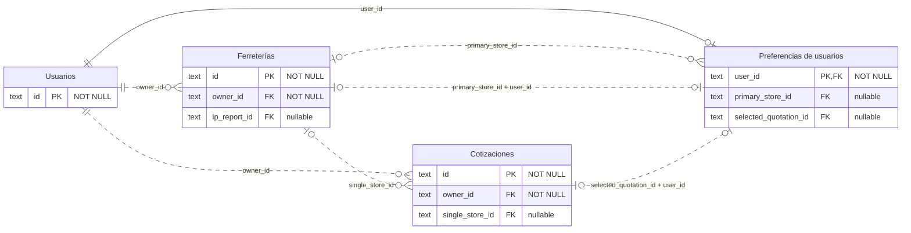
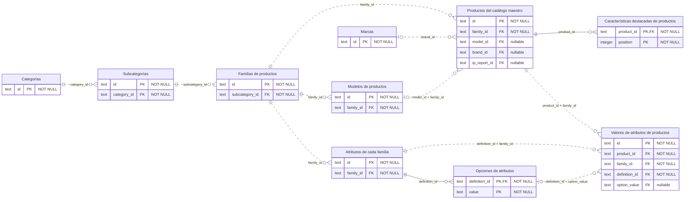
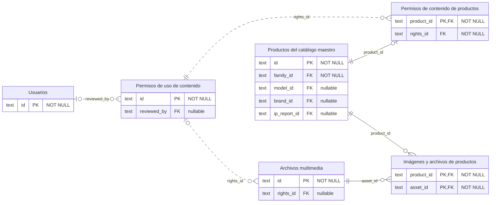
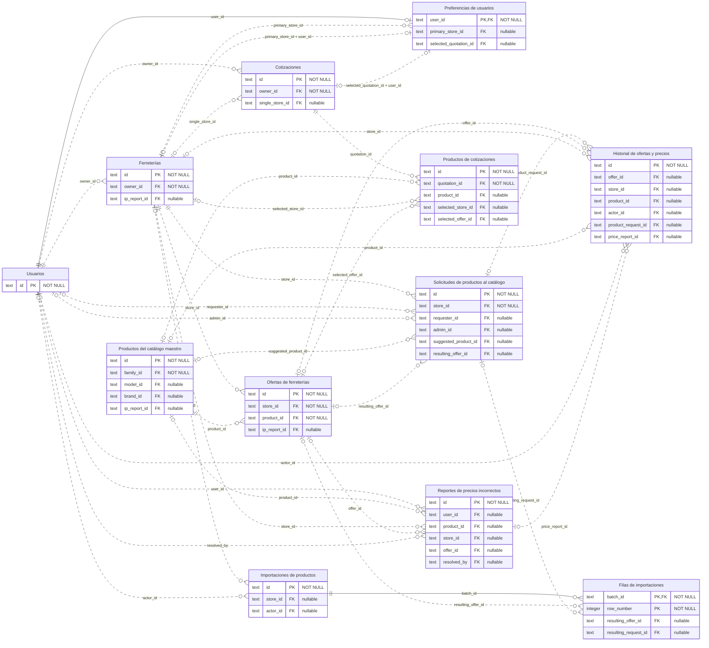
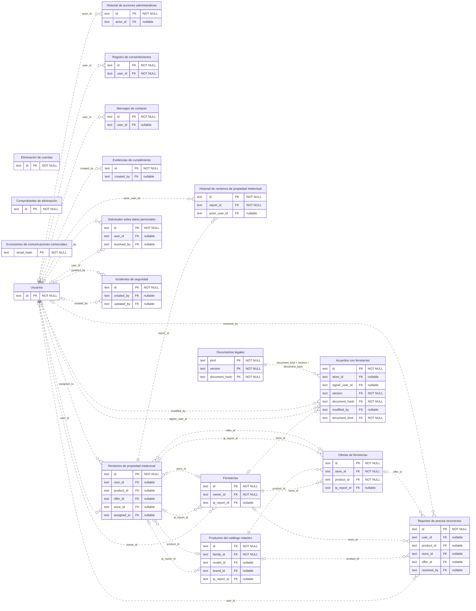
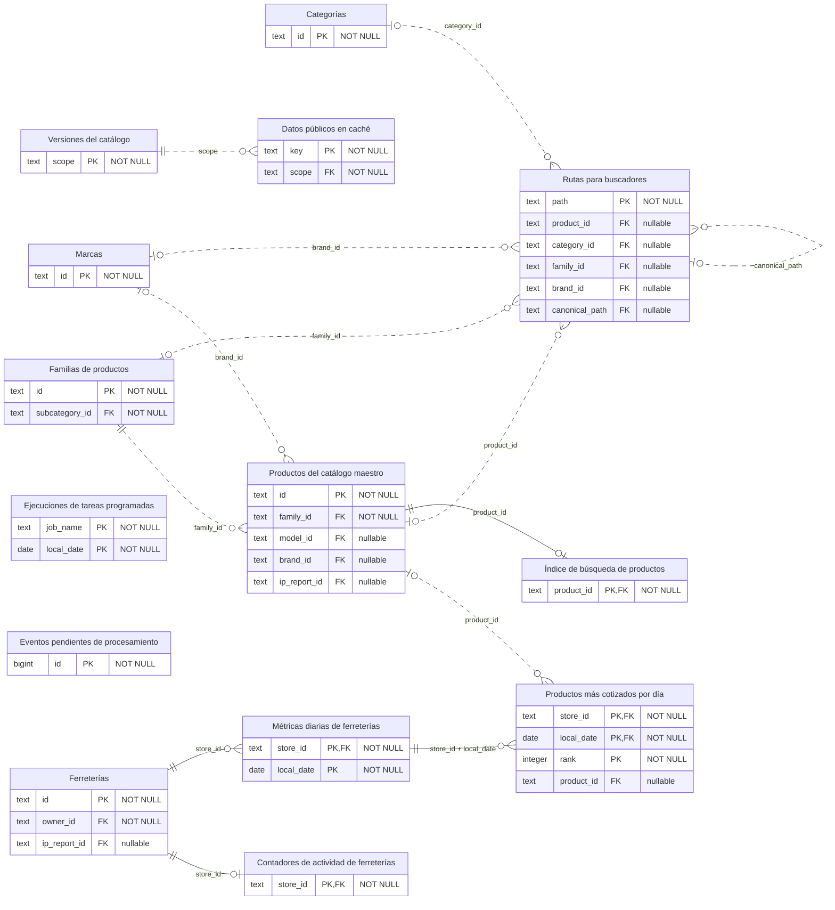
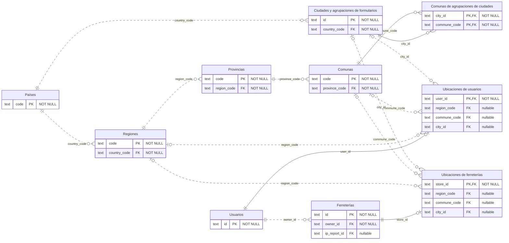
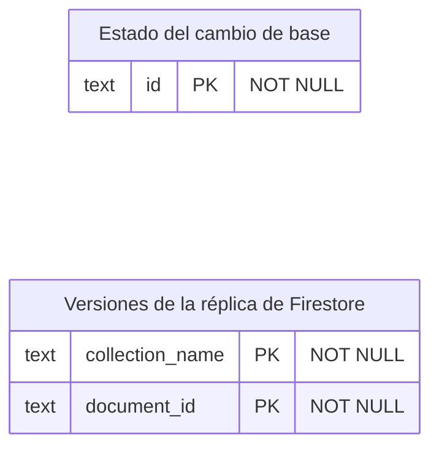
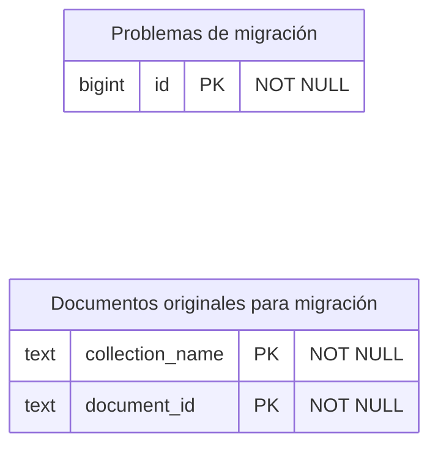
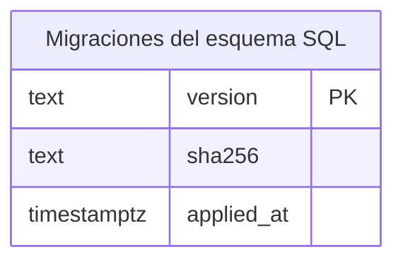

# Diagrama completo de la base de datos Findi

Generado a partir de las claves y columnas reales de [001-schema.sql](../../sql/findi/001-schema.sql) [005-runtime-compatibility.sql](../../sql/findi/005-runtime-compatibility.sql) [008-location-reference-tables.sql](../../sql/findi/008-location-reference-tables.sql), [011-quotation-verification.sql](../../sql/findi/011-quotation-verification.sql), [012-advisory-quotation-period.sql](../../sql/findi/012-advisory-quotation-period.sql) y [013-store-reviews.sql](../../sql/findi/013-store-reviews.sql). Incluye **59 tablas del esquema findi y 2 tablas temporales de findi_migration**, todas sus columnas y las 101 claves foráneas declaradas. El servidor ya admite este modelo; Firestore sigue activo mientras USE_SQL_DATABASE sea false.

Abre la vista previa Markdown para visualizarlo. El [archivo Mermaid independiente](diagrama-completo.mmd) permite ampliar y exportar el diagrama en un visor compatible. Al final hay vistas por área para explorar el mismo modelo con menos cruces.

## Cómo leerlo

- PK: clave primaria; FK: clave foránea; UK: restricción única de una sola columna. Las restricciones únicas compuestas y los índices parciales están en el SQL.
- Cada columna indica NOT NULL o nullable. Una FK compuesta aparece como una sola línea con sus columnas unidas por +.
- || significa exactamente uno; o| significa cero o uno; o{ significa cero o muchos.
- Línea continua: la FK completa forma parte de la PK de la tabla hija. Línea discontinua: la relación no es identificadora.
- Las tablas sin líneas también forman parte de la solución: no tienen una FK declarada. Las referencias históricas y los payloads JSON no se dibujan como relaciones garantizadas.
- Los recuadros muestran nombres descriptivos en español. La tabla de correspondencias al final permite ubicar cada tabla por su nombre exacto en SQL. Los identificadores internos de Mermaid y los nombres de columnas conservan su correspondencia con el esquema.
- Las vistas públicas, índices, triggers, RLS y reglas de negocio se explican en el [diseño](diseno-relacional-findi.md) y en los archivos SQL; no son tablas adicionales.

## Modelo completo: todas las tablas y columnas

```mermaid
erDiagram
  direction LR
  account_deletion_jobs["Eliminación de cuentas"] {
    text id PK "NOT NULL"
    text user_id "nullable"
    text status "NOT NULL"
    timestamptz auth_delete_confirmed_at "nullable"
    timestamptz completed_at "nullable"
    integer attempts "NOT NULL"
    timestamptz requested_at "NOT NULL"
    text last_error_code "nullable"
    timestamptz backup_erasure_expected_by "nullable"
  }
  account_locations["Ubicaciones de usuarios"] {
    text user_id PK,FK "NOT NULL"
    text region_code FK "nullable"
    text commune_code FK "nullable"
    text city_id FK "nullable"
    timestamptz matched_at "NOT NULL"
  }
  account_preferences["Preferencias de usuarios"] {
    text user_id PK,FK "NOT NULL"
    text primary_store_id FK "nullable"
    text selected_quotation_id FK "nullable"
    timestamptz updated_at "NOT NULL"
  }
  admin_audit_logs["Historial de acciones administrativas"] {
    text id PK "NOT NULL"
    text actor_id FK "nullable"
    text action "NOT NULL"
    text actor_role "nullable"
    text method "nullable"
    text path "nullable"
    text target_type "nullable"
    text target_reference "nullable"
    integer status_code "nullable"
    text outcome "nullable"
    text result_code "nullable"
    jsonb details "NOT NULL"
    timestamptz occurred_at "NOT NULL"
    timestamptz retention_until "nullable"
    jsonb api_payload "nullable"
    bigint api_version "NOT NULL"
  }
  attribute_definitions["Atributos de cada familia"] {
    text id PK "NOT NULL"
    text family_id FK "NOT NULL"
    text code "NOT NULL"
    text label "NOT NULL"
    text unit "nullable"
    text data_type "NOT NULL"
    boolean filterable "NOT NULL"
    boolean required "NOT NULL"
    integer position "NOT NULL"
    jsonb api_payload "nullable"
    bigint api_version "NOT NULL"
  }
  attribute_options["Opciones de atributos"] {
    text definition_id PK,FK "NOT NULL"
    text value PK "NOT NULL"
    text label "nullable"
    integer position "NOT NULL"
  }
  brands["Marcas"] {
    text id PK "NOT NULL"
    text name "NOT NULL"
    text normalized_name UK "NOT NULL"
    timestamptz created_at "NOT NULL"
    timestamptz updated_at "NOT NULL"
    jsonb api_payload "nullable"
    bigint api_version "NOT NULL"
  }
  catalog_revisions["Versiones del catálogo"] {
    text scope PK "NOT NULL"
    bigint revision "NOT NULL"
    timestamptz changed_at "NOT NULL"
  }
  catalog_search_documents["Índice de búsqueda de productos"] {
    text product_id PK,FK "NOT NULL"
    text normalized_text "NOT NULL"
    tsvector search_vector "NOT NULL"
    bigint version "NOT NULL"
    timestamptz updated_at "NOT NULL"
  }
  categories["Categorías"] {
    text id PK "NOT NULL"
    text name "NOT NULL"
    text icon "NOT NULL"
    timestamptz created_at "NOT NULL"
    timestamptz updated_at "NOT NULL"
    jsonb api_payload "nullable"
    bigint api_version "NOT NULL"
  }
  cities["Ciudades y agrupaciones de formularios"] {
    text id PK "NOT NULL"
    text country_code FK "NOT NULL"
    text name "NOT NULL"
    text kind "NOT NULL"
    text source_reference "NOT NULL"
  }
  city_communes["Comunas de agrupaciones de ciudades"] {
    text city_id PK,FK "NOT NULL"
    text commune_code PK,FK "NOT NULL"
    text source_reference "NOT NULL"
  }
  communes["Comunas"] {
    text code PK "NOT NULL"
    text province_code FK "NOT NULL"
    text name "NOT NULL"
    text normalized_name "NOT NULL"
  }
  consent_events["Registro de consentimientos"] {
    text id PK "NOT NULL"
    text user_id FK "NOT NULL"
    text type "NOT NULL"
    text version "NOT NULL"
    boolean granted "NOT NULL"
    text source "NOT NULL"
    timestamptz occurred_at "NOT NULL"
    text document_hash "nullable"
    text purpose "nullable"
    boolean express_consent "nullable"
    jsonb evidence "NOT NULL"
    jsonb api_payload "nullable"
    bigint api_version "NOT NULL"
  }
  contact_messages["Mensajes de contacto"] {
    text id PK "NOT NULL"
    text user_id FK "nullable"
    text type "NOT NULL"
    text name "nullable"
    text email "nullable"
    text phone "nullable"
    text commune "nullable"
    text business_name "nullable"
    text message "NOT NULL"
    text status "NOT NULL"
    jsonb privacy_consent "NOT NULL"
    jsonb legal_acceptance "nullable"
    timestamptz created_at "NOT NULL"
    timestamptz updated_at "nullable"
    jsonb api_payload "nullable"
    bigint api_version "NOT NULL"
  }
  content_rights["Permisos de uso de contenido"] {
    text id PK "NOT NULL"
    text source_type "NOT NULL"
    text provider "nullable"
    text source_url "nullable"
    text source_terms_url "nullable"
    text authorization_reference "NOT NULL"
    boolean contains_third_party_marks "NOT NULL"
    text trademark_authorization_reference "nullable"
    text reviewed_by FK "nullable"
    timestamptz reviewed_at "nullable"
    boolean legal_hold "NOT NULL"
    timestamptz retention_until "nullable"
  }
  countries["Países"] {
    text code PK "NOT NULL"
    text name "NOT NULL"
  }
  database_migration_state["Estado del cambio de base"] {
    text id PK "NOT NULL"
    text status "NOT NULL"
    text source_project "NOT NULL"
    timestamptz verified_at "nullable"
    jsonb manifest "NOT NULL"
    timestamptz updated_at "NOT NULL"
  }
  deletion_receipts["Comprobantes de eliminación"] {
    text id PK "NOT NULL"
    timestamptz completed_at "NOT NULL"
    jsonb counts "NOT NULL"
    text source "NOT NULL"
    timestamptz retention_until "nullable"
    jsonb api_payload "nullable"
    bigint api_version "NOT NULL"
  }
  families["Familias de productos"] {
    text id PK "NOT NULL"
    text subcategory_id FK "NOT NULL"
    text name "NOT NULL"
    jsonb api_payload "nullable"
    bigint api_version "NOT NULL"
  }
  governance_evidence["Evidencias de cumplimiento"] {
    text id PK "NOT NULL"
    text type "NOT NULL"
    text outcome "NOT NULL"
    text title "NOT NULL"
    text owner_label "NOT NULL"
    timestamptz performed_at "NOT NULL"
    timestamptz next_review_at "nullable"
    text notes "nullable"
    text evidence_url "nullable"
    timestamptz created_at "nullable"
    text created_by FK "nullable"
    boolean legal_hold "NOT NULL"
    timestamptz retention_until "nullable"
    jsonb api_payload "nullable"
    bigint api_version "NOT NULL"
  }
  import_batches["Importaciones de productos"] {
    text id PK "NOT NULL"
    text store_id FK "nullable"
    text actor_id FK "nullable"
    text source_name "nullable"
    text status "NOT NULL"
    timestamptz created_at "NOT NULL"
    timestamptz completed_at "nullable"
    integer total_rows "nullable"
    integer successful_rows "nullable"
    integer rejected_rows "nullable"
  }
  import_rows["Filas de importaciones"] {
    text batch_id PK,FK "NOT NULL"
    integer row_number PK "NOT NULL"
    text status "NOT NULL"
    text error_code "nullable"
    text resulting_offer_id FK "nullable"
    text resulting_request_id FK "nullable"
    jsonb input_snapshot "nullable"
  }
  ip_report_events["Historial de reclamos de propiedad intelectual"] {
    text id PK "NOT NULL"
    text report_id FK "NOT NULL"
    integer position "NOT NULL"
    text status "NOT NULL"
    timestamptz occurred_at "NOT NULL"
    text actor_user_id FK "nullable"
    text actor_kind "nullable"
    text resolution "nullable"
  }
  ip_reports["Reclamos de propiedad intelectual"] {
    text id PK "NOT NULL"
    text user_id FK "nullable"
    text reference UK "NOT NULL"
    text receipt_token_hash "nullable"
    text claimant_name "nullable"
    text claimant_email "nullable"
    text claimant_organization "nullable"
    text claimant_capacity "nullable"
    text rights_type "NOT NULL"
    text content_type "NOT NULL"
    text target_type "NOT NULL"
    text target_reference "nullable"
    text product_id FK "nullable"
    text offer_id FK "nullable"
    text store_id FK "nullable"
    text content_url "NOT NULL"
    text original_work_url "nullable"
    text work_description "nullable"
    text infringement_description "nullable"
    jsonb declarations "NOT NULL"
    jsonb privacy_consent "NOT NULL"
    text status "NOT NULL"
    text public_status_message "nullable"
    text assigned_to FK "nullable"
    timestamptz submitted_at "NOT NULL"
    timestamptz acknowledged_at "nullable"
    timestamptz initial_review_due_at "nullable"
    timestamptz target_resolution_at "nullable"
    text resolution "nullable"
    timestamptz resolved_at "nullable"
    timestamptz updated_at "nullable"
    timestamptz minimized_at "nullable"
    boolean legal_hold "NOT NULL"
    timestamptz retention_until "nullable"
    jsonb api_payload "nullable"
    bigint api_version "NOT NULL"
  }
  job_runs["Ejecuciones de tareas programadas"] {
    text job_name PK "NOT NULL"
    date local_date PK "NOT NULL"
    text time_zone "NOT NULL"
    text status "NOT NULL"
    timestamptz started_at "NOT NULL"
    timestamptz completed_at "nullable"
    timestamptz failed_at "nullable"
    text error_code "nullable"
    integer stores_processed "nullable"
    jsonb api_payload "nullable"
    bigint api_version "NOT NULL"
  }
  legal_documents["Documentos legales"] {
    text kind PK "NOT NULL"
    text version PK "NOT NULL"
    text document_hash PK "NOT NULL"
    jsonb content "NOT NULL"
    timestamptz effective_at "nullable"
    boolean is_current "NOT NULL"
  }
  marketing_suppressions["Exclusiones de comunicaciones comerciales"] {
    text email_hash PK "NOT NULL"
    text hash_scheme "NOT NULL"
    timestamptz suppressed_at "NOT NULL"
    text source "NOT NULL"
    jsonb api_payload "nullable"
    bigint api_version "NOT NULL"
  }
  media_assets["Archivos multimedia"] {
    text id PK "NOT NULL"
    text url "NOT NULL"
    text storage_path "nullable"
    text mime_type "nullable"
    text origin "NOT NULL"
    text rights_id FK "nullable"
    text generated_by "nullable"
    text generation_reference "nullable"
    text ai_disclosure "nullable"
    text alt_text "nullable"
    timestamptz created_at "NOT NULL"
  }
  offer_history["Historial de ofertas y precios"] {
    text id PK "NOT NULL"
    text offer_id FK "nullable"
    text store_id FK "nullable"
    text product_id FK "nullable"
    text offer_reference "NOT NULL"
    text store_reference "NOT NULL"
    text product_reference "NOT NULL"
    text actor_id FK "nullable"
    timestamptz actor_account_deleted_at "nullable"
    text action "NOT NULL"
    text source "NOT NULL"
    nonnegative_amount old_price "nullable"
    nonnegative_amount new_price "nullable"
    boolean includes_vat "NOT NULL"
    jsonb before_snapshot "nullable"
    jsonb after_snapshot "nullable"
    text product_request_id FK "nullable"
    text price_report_id FK "nullable"
    timestamptz occurred_at "NOT NULL"
    boolean legal_hold "NOT NULL"
    timestamptz retention_until "nullable"
    jsonb api_payload "nullable"
    bigint api_version "NOT NULL"
  }
  offers["Ofertas de ferreterías"] {
    text id PK "NOT NULL"
    text store_id FK "NOT NULL"
    text product_id FK "NOT NULL"
    text store_sku "nullable"
    text barcode "nullable"
    nonnegative_amount price "NOT NULL"
    text currency "NOT NULL"
    bigint stock "NOT NULL"
    boolean includes_vat "NOT NULL"
    text measurement_unit "nullable"
    positive_quantity measurement_quantity "nullable"
    text measurement_source "nullable"
    timestamptz valid_from "nullable"
    timestamptz valid_until "nullable"
    text conditions "nullable"
    boolean active "NOT NULL"
    boolean published "NOT NULL"
    boolean sponsored "NOT NULL"
    text withdrawal_reason "nullable"
    text ip_status "nullable"
    jsonb previous_ip_state "nullable"
    text ip_report_id FK "nullable"
    timestamptz created_at "NOT NULL"
    timestamptz updated_at "NOT NULL"
    jsonb api_payload "nullable"
    bigint api_version "NOT NULL"
  }
  outbox_events["Eventos pendientes de procesamiento"] {
    bigint id PK "NOT NULL"
    text topic "NOT NULL"
    text entity_type "nullable"
    text entity_reference "nullable"
    jsonb payload "NOT NULL"
    timestamptz created_at "NOT NULL"
    timestamptz processed_at "nullable"
    integer attempts "NOT NULL"
    text last_error_code "nullable"
  }
  price_reports["Reportes de precios incorrectos"] {
    text id PK "NOT NULL"
    text reference UK "NOT NULL"
    text user_id FK "nullable"
    text email "nullable"
    text product_id FK "nullable"
    text store_id FK "nullable"
    text offer_id FK "nullable"
    text product_name_snapshot "NOT NULL"
    text store_name_snapshot "NOT NULL"
    text store_reference "NOT NULL"
    text offer_reference "NOT NULL"
    text content_url "nullable"
    nonnegative_amount displayed_price "NOT NULL"
    nonnegative_amount catalog_price_at_report "NOT NULL"
    nonnegative_amount observed_price "NOT NULL"
    text details "nullable"
    jsonb privacy_consent "NOT NULL"
    text status "NOT NULL"
    text resolution "nullable"
    timestamptz resolved_at "nullable"
    text resolved_by FK "nullable"
    timestamptz created_at "NOT NULL"
    timestamptz updated_at "nullable"
    timestamptz minimized_at "nullable"
    boolean legal_hold "NOT NULL"
    timestamptz retention_until "nullable"
    jsonb api_payload "nullable"
    bigint api_version "NOT NULL"
  }
  privacy_requests["Solicitudes sobre datos personales"] {
    text id PK "NOT NULL"
    text user_id FK "nullable"
    text email "nullable"
    text type "NOT NULL"
    text details "nullable"
    text status "NOT NULL"
    timestamptz submitted_at "NOT NULL"
    timestamptz acknowledged_at "nullable"
    timestamptz response_due_at "nullable"
    timestamptz blocking_due_at "nullable"
    text resolution "nullable"
    timestamptz resolved_at "nullable"
    text resolved_by FK "nullable"
    timestamptz updated_at "nullable"
    boolean legal_hold "NOT NULL"
    timestamptz retention_until "nullable"
    jsonb api_payload "nullable"
    bigint api_version "NOT NULL"
  }
  product_attributes["Valores de atributos de productos"] {
    text id PK "NOT NULL"
    text product_id FK "NOT NULL"
    text family_id FK "NOT NULL"
    text definition_id FK "NOT NULL"
    text code_snapshot "nullable"
    text label_snapshot "nullable"
    text text_value "nullable"
    numeric numeric_value "nullable"
    boolean boolean_value "nullable"
    text option_value FK "nullable"
    jsonb api_payload "nullable"
    bigint api_version "NOT NULL"
  }
  product_content_rights["Permisos de contenido de productos"] {
    text product_id PK,FK "NOT NULL"
    text rights_id FK "NOT NULL"
  }
  product_features["Características destacadas de productos"] {
    text product_id PK,FK "NOT NULL"
    integer position PK "NOT NULL"
    text text "NOT NULL"
  }
  product_media["Imágenes y archivos de productos"] {
    text product_id PK,FK "NOT NULL"
    text asset_id PK,FK "NOT NULL"
    integer position "NOT NULL"
    boolean in_gallery "NOT NULL"
    boolean is_primary "NOT NULL"
  }
  product_models["Modelos de productos"] {
    text id PK "NOT NULL"
    text family_id FK "NOT NULL"
    text name "NOT NULL"
    text description "nullable"
  }
  product_requests["Solicitudes de productos al catálogo"] {
    text id PK "NOT NULL"
    text store_id FK "NOT NULL"
    text requester_id FK "nullable"
    text admin_id FK "nullable"
    text product_name "NOT NULL"
    text barcode "nullable"
    text store_sku "nullable"
    boolean published "NOT NULL"
    bigint reference_quantity "nullable"
    nonnegative_amount reference_price "nullable"
    text status "NOT NULL"
    text request_type "NOT NULL"
    text suggested_product_id FK "nullable"
    text resulting_offer_id FK "nullable"
    text admin_notes "nullable"
    timestamptz created_at "NOT NULL"
    timestamptz resolved_at "nullable"
    jsonb api_payload "nullable"
    bigint api_version "NOT NULL"
  }
  products["Productos del catálogo maestro"] {
    text id PK "NOT NULL"
    text family_id FK "NOT NULL"
    text model_id FK "nullable"
    text brand_id FK "nullable"
    text legacy_brand_label "nullable"
    text name "NOT NULL"
    text product_type "nullable"
    text catalog_level "NOT NULL"
    text sale_unit "nullable"
    text presentation "nullable"
    text barcode "nullable"
    text short_description "nullable"
    text long_description "nullable"
    nonnegative_amount logistics_weight_kg "nullable"
    nonnegative_amount logistics_volume_m3 "nullable"
    nonnegative_amount units_per_pallet "nullable"
    text status "NOT NULL"
    text source_kind "nullable"
    text source_reference "nullable"
    text source_batch "nullable"
    text ip_status "nullable"
    timestamptz deleted_at "nullable"
    timestamptz created_at "NOT NULL"
    timestamptz updated_at "NOT NULL"
    text ip_report_id FK "nullable"
    jsonb api_payload "nullable"
    bigint api_version "NOT NULL"
    text model_label "nullable"
    text manufacturer_code "nullable"
    jsonb catalog_evidence "nullable"
  }
  provinces["Provincias"] {
    text code PK "NOT NULL"
    text region_code FK "NOT NULL"
    text name "NOT NULL"
  }
  public_cache_artifacts["Datos públicos en caché"] {
    text key PK "NOT NULL"
    text scope FK "NOT NULL"
    text version "NOT NULL"
    text object_path "nullable"
    jsonb payload "nullable"
    integer schema_version "NOT NULL"
    timestamptz updated_at "NOT NULL"
    timestamptz expires_at "nullable"
  }
  quotation_items["Productos de cotizaciones"] {
    text id PK "NOT NULL"
    text quotation_id FK "NOT NULL"
    integer position "NOT NULL"
    text product_id FK "nullable"
    text product_name_snapshot "NOT NULL"
    bigint quantity "NOT NULL"
    text selected_store_id FK "nullable"
    text selected_store_name_snapshot "nullable"
    text selected_offer_id FK "nullable"
    text product_reference "nullable"
    text store_reference "nullable"
    text offer_reference "nullable"
    text resolution_state "NOT NULL"
  }
  quotation_verifications["Verificación de cotizaciones por código"] {
    text id PK "Código aleatorio del servidor"
    text code UK "Código visible"
    text quotation_reference "Referencia histórica, sin FK"
    timestamptz issued_at "Emisión de esta versión"
    timestamptz recommended_until "Plazo informativo"
    jsonb store_lines "Productos y precios por ferretería"
    jsonb api_payload "Versión inmutable"
    bigint api_version "NOT NULL"
  }
  quotations["Cotizaciones"] {
    text id PK "NOT NULL"
    text owner_id FK "NOT NULL"
    text name "NOT NULL"
    text address "nullable"
    numeric proximity_latitude "nullable"
    numeric proximity_longitude "nullable"
    positive_quantity proximity_radius_km "nullable"
    text single_store_id FK "nullable"
    text single_store_name_snapshot "nullable"
    text single_store_reference "nullable"
    text status "nullable"
    timestamptz created_at "NOT NULL"
    timestamptz updated_at "nullable"
    jsonb api_payload "nullable"
    bigint api_version "NOT NULL"
  }
  regions["Regiones"] {
    text code PK "NOT NULL"
    text country_code FK "NOT NULL"
    text name "NOT NULL"
    text abbreviation "NOT NULL"
    text source_reference "NOT NULL"
  }
  security_incidents["Incidentes de seguridad"] {
    text id PK "NOT NULL"
    text title "NOT NULL"
    text description "nullable"
    text severity "NOT NULL"
    text status "NOT NULL"
    timestamptz detected_at "NOT NULL"
    text__ systems "nullable"
    text__ data_categories "nullable"
    bigint affected_people_estimate "nullable"
    boolean reasonable_risk "nullable"
    boolean agency_notification_required "nullable"
    text containment_actions "nullable"
    text root_cause "nullable"
    text lessons_learned "nullable"
    timestamptz agency_notified_at "nullable"
    timestamptz subjects_notified_at "nullable"
    timestamptz closed_at "nullable"
    text created_by FK "nullable"
    text updated_by FK "nullable"
    timestamptz created_at "nullable"
    timestamptz updated_at "nullable"
    boolean legal_hold "NOT NULL"
    timestamptz retention_until "nullable"
    jsonb api_payload "nullable"
    bigint api_version "NOT NULL"
  }
  seo_routes["Rutas para buscadores"] {
    text path PK "NOT NULL"
    text product_id FK "nullable"
    text category_id FK "nullable"
    text family_id FK "nullable"
    text brand_id FK "nullable"
    text canonical_path FK "nullable"
    boolean is_canonical "NOT NULL"
    boolean active "NOT NULL"
    text title_override "nullable"
    text description_override "nullable"
    timestamptz created_at "NOT NULL"
  }
  source_replication_versions["Versiones de la réplica de Firestore"] {
    text collection_name PK "NOT NULL"
    text document_id PK "NOT NULL"
    numeric source_version "NOT NULL"
    boolean deleted "NOT NULL"
    timestamptz replicated_at "NOT NULL"
  }
  store_agreements["Acuerdos con ferreterías"] {
    text id PK "NOT NULL"
    text store_id FK "nullable"
    text store_reference "NOT NULL"
    text signer_user_id FK "nullable"
    text version FK "NOT NULL"
    text document_hash FK "NOT NULL"
    text status "NOT NULL"
    jsonb provider_snapshot "NOT NULL"
    jsonb store_snapshot "NOT NULL"
    jsonb signer_snapshot "NOT NULL"
    jsonb declarations "NOT NULL"
    jsonb evidence "NOT NULL"
    timestamptz accepted_at "NOT NULL"
    timestamptz updated_at "nullable"
    timestamptz terminated_at "nullable"
    text termination_reason "nullable"
    text modified_by FK "nullable"
    boolean legal_hold "NOT NULL"
    timestamptz delete_after "nullable"
    text document_kind FK "NOT NULL"
    jsonb api_payload "nullable"
    bigint api_version "NOT NULL"
  }
  store_daily_analytics["Métricas diarias de ferreterías"] {
    text store_id PK,FK "NOT NULL"
    date local_date PK "NOT NULL"
    integer schema_version "NOT NULL"
    timestamptz computed_at "NOT NULL"
    integer active_window_days "NOT NULL"
    bigint quotation_count "NOT NULL"
    bigint quoted_lines "NOT NULL"
    bigint quoted_units "NOT NULL"
    bigint quoted_products "NOT NULL"
    bigint active_quotation_count "NOT NULL"
    bigint active_quoted_units "NOT NULL"
    nonnegative_amount active_quoted_amount "NOT NULL"
    bigint recent_quotation_count "NOT NULL"
    bigint previous_quotation_count "NOT NULL"
    bigint views "NOT NULL"
    bigint selections "NOT NULL"
    bigint catalog_total "NOT NULL"
    bigint catalog_published "NOT NULL"
    bigint catalog_in_stock "NOT NULL"
    bigint catalog_out_of_stock "NOT NULL"
    bigint catalog_stale_prices "NOT NULL"
    jsonb api_payload "nullable"
    bigint api_version "NOT NULL"
  }
  store_daily_top_products["Productos más cotizados por día"] {
    text store_id PK,FK "NOT NULL"
    date local_date PK,FK "NOT NULL"
    integer rank PK "NOT NULL"
    text product_id FK "nullable"
    text product_reference "NOT NULL"
    text product_name_snapshot "NOT NULL"
    bigint quotation_count "NOT NULL"
    bigint units "NOT NULL"
    nonnegative_amount active_amount "NOT NULL"
    bigint stock "NOT NULL"
  }
  store_event_counters["Contadores de actividad de ferreterías"] {
    text store_id PK,FK "NOT NULL"
    bigint views "NOT NULL"
    bigint selections "NOT NULL"
    timestamptz updated_at "nullable"
    jsonb api_payload "nullable"
    bigint api_version "NOT NULL"
  }
  store_locations["Ubicaciones de ferreterías"] {
    text store_id PK,FK "NOT NULL"
    text region_code FK "nullable"
    text commune_code FK "nullable"
    text city_id FK "nullable"
    timestamptz matched_at "NOT NULL"
  }
  store_reviews["Reseñas de ferreterías"] {
    text id PK "NOT NULL"
    text store_id FK "NOT NULL"
    text user_id FK "NOT NULL"
    text author_name "NOT NULL"
    integer rating "NOT NULL, 1 a 5"
    text comment "NOT NULL, 5 a 1500 caracteres"
    timestamptz created_at "NOT NULL"
    timestamptz updated_at "NOT NULL"
    jsonb api_payload "NOT NULL"
  }
  stores["Ferreterías"] {
    text id PK "NOT NULL"
    text owner_id FK "NOT NULL"
    text business_name "NOT NULL"
    text legal_name "nullable"
    text tax_id "nullable"
    text branch_name "nullable"
    text address "nullable"
    text region "nullable"
    text city "nullable"
    text commune "nullable"
    text public_email "nullable"
    text public_phone "nullable"
    numeric latitude "nullable"
    numeric longitude "nullable"
    text status "NOT NULL"
    text agreement_status "NOT NULL"
    text agreement_version "nullable"
    text agreement_document_hash "nullable"
    timestamptz agreement_accepted_at "nullable"
    timestamptz agreement_updated_at "nullable"
    timestamptz catalog_updated_at "nullable"
    text ip_status "nullable"
    jsonb previous_ip_state "nullable"
    timestamptz created_at "NOT NULL"
    timestamptz updated_at "NOT NULL"
    text ip_report_id FK "nullable"
    jsonb api_payload "nullable"
    bigint api_version "NOT NULL"
  }
  subcategories["Subcategorías"] {
    text id PK "NOT NULL"
    text category_id FK "NOT NULL"
    text name "NOT NULL"
    jsonb api_payload "nullable"
    bigint api_version "NOT NULL"
  }
  users["Usuarios"] {
    text id PK "NOT NULL"
    text role "NOT NULL"
    text name "NOT NULL"
    text email "NOT NULL"
    text phone "nullable"
    text region "nullable"
    text city "nullable"
    text commune "nullable"
    text address "nullable"
    text account_status "NOT NULL"
    boolean processing_blocked "NOT NULL"
    timestamptz blocked_at "nullable"
    timestamptz unblocked_at "nullable"
    text terms_version "nullable"
    timestamptz terms_accepted_at "nullable"
    text privacy_version "nullable"
    timestamptz privacy_informed_at "nullable"
    boolean age_confirmed "NOT NULL"
    boolean marketing_consent "NOT NULL"
    timestamptz marketing_updated_at "nullable"
    integer quotation_limit "NOT NULL"
    timestamptz created_at "NOT NULL"
    timestamptz updated_at "NOT NULL"
    jsonb api_payload "nullable"
    bigint api_version "NOT NULL"
  }
  migration_issues["Problemas de migración"] {
    bigint id PK "NOT NULL"
    text collection_name "NOT NULL"
    text document_id "NOT NULL"
    text field_name "nullable"
    text issue_code "NOT NULL"
    text resolution "nullable"
    timestamptz resolved_at "nullable"
  }
  migration_source_documents["Documentos originales para migración"] {
    text collection_name PK "NOT NULL"
    text document_id PK "NOT NULL"
    jsonb source_payload "NOT NULL"
    text source_hash "NOT NULL"
    timestamptz exported_at "NOT NULL"
    timestamptz expires_at "NOT NULL"
    text status "NOT NULL"
  }
  users ||..o{ stores : "owner_id"
  users ||--o| account_preferences : "user_id"
  stores o|..o{ account_preferences : "primary_store_id"
  stores o|..o| account_preferences : "primary_store_id + user_id"
  categories ||..o{ subcategories : "category_id"
  subcategories ||..o{ families : "subcategory_id"
  families ||..o{ product_models : "family_id"
  families ||..o{ products : "family_id"
  brands o|..o{ products : "brand_id"
  product_models o|..o{ products : "model_id + family_id"
  products ||--o{ product_features : "product_id"
  families ||..o{ attribute_definitions : "family_id"
  attribute_definitions ||--o{ attribute_options : "definition_id"
  products ||..o{ product_attributes : "product_id + family_id"
  attribute_definitions ||..o{ product_attributes : "definition_id + family_id"
  attribute_options o|..o{ product_attributes : "definition_id + option_value"
  users o|..o{ content_rights : "reviewed_by"
  products ||--o| product_content_rights : "product_id"
  content_rights ||..o{ product_content_rights : "rights_id"
  content_rights o|..o{ media_assets : "rights_id"
  products ||--o{ product_media : "product_id"
  media_assets ||--o{ product_media : "asset_id"
  users ||..o{ consent_events : "user_id"
  stores o|..o{ store_agreements : "store_id"
  users o|..o{ store_agreements : "signer_user_id"
  users o|..o{ store_agreements : "modified_by"
  legal_documents ||..o{ store_agreements : "document_kind + version + document_hash"
  stores ||..o{ offers : "store_id"
  products ||..o{ offers : "product_id"
  users o|..o{ privacy_requests : "user_id"
  stores ||..o{ product_requests : "store_id"
  users o|..o{ product_requests : "requester_id"
  users o|..o{ product_requests : "admin_id"
  products o|..o{ product_requests : "suggested_product_id"
  offers o|..o{ product_requests : "resulting_offer_id"
  users o|..o{ privacy_requests : "resolved_by"
  users ||..o{ quotations : "owner_id"
  stores o|..o{ quotations : "single_store_id"
  quotations ||..o{ quotation_items : "quotation_id"
  products o|..o{ quotation_items : "product_id"
  stores o|..o{ quotation_items : "selected_store_id"
  offers o|..o{ quotation_items : "selected_offer_id"
  quotations o|..o| account_preferences : "selected_quotation_id + user_id"
  users o|..o{ contact_messages : "user_id"
  product_requests o|..o{ offer_history : "product_request_id"
  users o|..o{ ip_reports : "user_id"
  products o|..o{ ip_reports : "product_id"
  offers o|..o{ ip_reports : "offer_id"
  stores o|..o{ ip_reports : "store_id"
  users o|..o{ ip_reports : "assigned_to"
  ip_reports ||..o{ ip_report_events : "report_id"
  users o|..o{ ip_report_events : "actor_user_id"
  ip_reports o|..o{ products : "ip_report_id"
  ip_reports o|..o{ stores : "ip_report_id"
  ip_reports o|..o{ offers : "ip_report_id"
  users o|..o{ price_reports : "user_id"
  products o|..o{ price_reports : "product_id"
  stores o|..o{ price_reports : "store_id"
  offers o|..o{ price_reports : "offer_id"
  users o|..o{ price_reports : "resolved_by"
  offers o|..o{ offer_history : "offer_id"
  stores o|..o{ offer_history : "store_id"
  products o|..o{ offer_history : "product_id"
  users o|..o{ offer_history : "actor_id"
  price_reports o|..o{ offer_history : "price_report_id"
  users o|..o{ admin_audit_logs : "actor_id"
  users o|..o{ security_incidents : "created_by"
  users o|..o{ security_incidents : "updated_by"
  users o|..o{ governance_evidence : "created_by"
  stores ||--o| store_event_counters : "store_id"
  stores ||--o{ store_daily_analytics : "store_id"
  products o|..o{ store_daily_top_products : "product_id"
  store_daily_analytics ||--o{ store_daily_top_products : "store_id + local_date"
  catalog_revisions ||..o{ public_cache_artifacts : "scope"
  products o|..o{ seo_routes : "product_id"
  categories o|..o{ seo_routes : "category_id"
  families o|..o{ seo_routes : "family_id"
  brands o|..o{ seo_routes : "brand_id"
  seo_routes o|..o{ seo_routes : "canonical_path"
  products ||--o| catalog_search_documents : "product_id"
  stores o|..o{ import_batches : "store_id"
  users o|..o{ import_batches : "actor_id"
  import_batches ||--o{ import_rows : "batch_id"
  offers o|..o{ import_rows : "resulting_offer_id"
  product_requests o|..o{ import_rows : "resulting_request_id"
  countries ||..o{ regions : "country_code"
  regions ||..o{ provinces : "region_code"
  provinces ||..o{ communes : "province_code"
  countries ||..o{ cities : "country_code"
  cities ||--o{ city_communes : "city_id"
  communes ||--o{ city_communes : "commune_code"
  users ||--o| account_locations : "user_id"
  regions o|..o{ account_locations : "region_code"
  communes o|..o{ account_locations : "commune_code"
  cities o|..o{ account_locations : "city_id"
  stores ||--o| store_locations : "store_id"
  regions o|..o{ store_locations : "region_code"
  communes o|..o{ store_locations : "commune_code"
  cities o|..o{ store_locations : "city_id"
  stores ||..o{ store_reviews : "store_id"
  users ||..o{ store_reviews : "user_id"
```

## Cuentas, ferreterías y preferencias

Vista de relaciones y claves; las columnas completas están en el modelo anterior. Solo se muestran las relaciones entre las tablas incluidas en esta vista.



## Catálogo, taxonomía, marcas y atributos

Vista de relaciones y claves; las columnas completas están en el modelo anterior. Solo se muestran las relaciones entre las tablas incluidas en esta vista.



## Imágenes y derechos de contenido

Vista de relaciones y claves; las columnas completas están en el modelo anterior. Solo se muestran las relaciones entre las tablas incluidas en esta vista.



## Ofertas, cotizaciones, solicitudes e importaciones

Vista de relaciones y claves; las columnas completas están en el modelo anterior. Solo se muestran las relaciones entre las tablas incluidas en esta vista.



## Documentos legales, privacidad y administración

Vista de relaciones y claves; las columnas completas están en el modelo anterior. Solo se muestran las relaciones entre las tablas incluidas en esta vista.



## Métricas nocturnas, búsqueda, SEO y caché

Vista de relaciones y claves; las columnas completas están en el modelo anterior. Solo se muestran las relaciones entre las tablas incluidas en esta vista.



## Regiones, comunas y ubicaciones

Vista de relaciones y claves; las columnas completas están en el modelo anterior. Solo se muestran las relaciones entre las tablas incluidas en esta vista.



## Control del cambio de base

Vista de relaciones y claves; las columnas completas están en el modelo anterior. Solo se muestran las relaciones entre las tablas incluidas en esta vista.



## Migración temporal

Vista de relaciones y claves; las columnas completas están en el modelo anterior. Solo se muestran las relaciones entre las tablas incluidas en esta vista.



## Correspondencia con el SQL

Los nombres en español son las etiquetas del diagrama. El esquema SQL conserva sus identificadores actuales, para mantener coherentes las claves foráneas, las vistas, los permisos y el mapa de migración.

| Nombre en el diagrama | Tabla en SQL | Para qué sirve |
| --- | --- | --- |
| Países | `findi.countries` | Países del catálogo territorial. |
| Regiones | `findi.regions` | Regiones oficiales con códigos CUT de SUBDERE. |
| Provincias | `findi.provinces` | Provincias y su región oficial. |
| Comunas | `findi.communes` | Comunas oficiales de Chile y su provincia. |
| Ciudades y agrupaciones de formularios | `findi.cities` | Opciones existentes en la aplicación; no son límites urbanos oficiales. |
| Comunas de agrupaciones de ciudades | `findi.city_communes` | Comunas que agrupa cada opción del formulario. |
| Ubicaciones de usuarios | `findi.account_locations` | Referencias territoriales derivadas de los datos reales de cada cuenta. |
| Ubicaciones de ferreterías | `findi.store_locations` | Referencias territoriales derivadas de los datos reales del local. |
| Estado del cambio de base | `findi.database_migration_state` | Controla la conciliación y la base activa. |
| Versiones de la réplica de Firestore | `findi.source_replication_versions` | Evita repetir o aplicar eventos antiguos de Firestore. |
| Eliminación de cuentas | `findi.account_deletion_jobs` | Coordina la eliminación de la cuenta en PostgreSQL y Firebase Auth. |
| Preferencias de usuarios | `findi.account_preferences` | Ferretería principal y cotización seleccionada. |
| Historial de acciones administrativas | `findi.admin_audit_logs` | Registra quién hizo cambios administrativos y su resultado. |
| Atributos de cada familia | `findi.attribute_definitions` | Define características como color, espesor o material. |
| Opciones de atributos | `findi.attribute_options` | Valores permitidos para atributos de selección. |
| Marcas | `findi.brands` | Marcas reales asociadas a productos. |
| Versiones del catálogo | `findi.catalog_revisions` | Versiones para actualizar el catálogo y las ofertas en caché. |
| Índice de búsqueda de productos | `findi.catalog_search_documents` | Información preparada para buscar productos rápidamente. |
| Categorías | `findi.categories` | Primer nivel de clasificación e iconos. |
| Registro de consentimientos | `findi.consent_events` | Aceptaciones de términos, aviso de privacidad, edad y marketing. |
| Mensajes de contacto | `findi.contact_messages` | Mensajes enviados desde el formulario de contacto. |
| Permisos de uso de contenido | `findi.content_rights` | Origen, autorizaciones y revisión de contenido e imágenes. |
| Comprobantes de eliminación | `findi.deletion_receipts` | Constancia de eliminación sin identificadores personales. |
| Familias de productos | `findi.families` | Agrupa tipos de productos dentro de una subcategoría. |
| Evidencias de cumplimiento | `findi.governance_evidence` | Documenta controles y revisiones de cumplimiento. |
| Importaciones de productos | `findi.import_batches` | Identifica cada carga masiva y sus resultados. |
| Filas de importaciones | `findi.import_rows` | Resultado de cada fila de una carga masiva. |
| Historial de reclamos de propiedad intelectual | `findi.ip_report_events` | Eventos y seguimiento de cada reclamo. |
| Reclamos de propiedad intelectual | `findi.ip_reports` | Reclamos sobre derechos de contenido y productos. |
| Ejecuciones de tareas programadas | `findi.job_runs` | Controla las tareas diarias para evitar ejecuciones duplicadas. |
| Documentos legales | `findi.legal_documents` | Versiones y contenido de términos, privacidad y acuerdos. |
| Exclusiones de comunicaciones comerciales | `findi.marketing_suppressions` | Registro para evitar envíos comerciales a quienes se excluyeron. |
| Archivos multimedia | `findi.media_assets` | Imágenes y otros archivos con su origen y permisos. |
| Historial de ofertas y precios | `findi.offer_history` | Cambios en precios y condiciones de las ofertas. |
| Ofertas de ferreterías | `findi.offers` | Precio, stock y condiciones de un producto en una ferretería. |
| Eventos pendientes de procesamiento | `findi.outbox_events` | Cambios que deben procesar los trabajadores, por ejemplo para actualizar cachés. |
| Reportes de precios incorrectos | `findi.price_reports` | Avisos sobre diferencias o errores de precios. |
| Solicitudes sobre datos personales | `findi.privacy_requests` | Solicitudes de derechos y su resolución. |
| Valores de atributos de productos | `findi.product_attributes` | Color, espesor y demás características de cada producto. |
| Permisos de contenido de productos | `findi.product_content_rights` | Relaciona la ficha de un producto con su autorización de contenido. |
| Características destacadas de productos | `findi.product_features` | Lista ordenada de características descriptivas. |
| Imágenes y archivos de productos | `findi.product_media` | Galería e imagen principal de cada producto. |
| Modelos de productos | `findi.product_models` | Agrupa variantes de un mismo modelo, cuando corresponda. |
| Solicitudes de productos al catálogo | `findi.product_requests` | Propuestas y modificaciones de productos; no son solicitudes de acceso. |
| Productos del catálogo maestro | `findi.products` | Fichas base y variantes comerciales, con su familia y marca. |
| Datos públicos en caché | `findi.public_cache_artifacts` | Contenido público preparado para cargar rápidamente. |
| Productos de cotizaciones | `findi.quotation_items` | Líneas de cada cotización con producto, cantidad y precio de referencia. |
| Cotizaciones | `findi.quotations` | Cotizaciones de usuarios y datos del proyecto. |
| Incidentes de seguridad | `findi.security_incidents` | Registro y seguimiento de incidentes. |
| Rutas para buscadores | `findi.seo_routes` | Direcciones públicas, rutas canónicas y alias. |
| Acuerdos con ferreterías | `findi.store_agreements` | Aceptaciones, versiones y estado del acuerdo de cada ferretería. |
| Métricas diarias de ferreterías | `findi.store_daily_analytics` | Resumen diario de actividad, productos y montos cotizados. |
| Productos más cotizados por día | `findi.store_daily_top_products` | Ranking diario de productos de cada ferretería. |
| Contadores de actividad de ferreterías | `findi.store_event_counters` | Totales agregados de visitas y selecciones. |
| Reseñas de ferreterías | `findi.store_reviews` | Puntuación y comentario de cada maestro; una reseña por usuario y local. |
| Ferreterías | `findi.stores` | Locales, propietarios, datos públicos y estado. |
| Subcategorías | `findi.subcategories` | Segundo nivel de clasificación del catálogo. |
| Usuarios | `findi.users` | Cuentas de maestros, ferreterías y administradores. |
| Problemas de migración | `findi_migration.issues` | Conflictos detectados durante la conciliación; tabla temporal. |
| Documentos originales para migración | `findi_migration.source_documents` | Datos originales para conciliar la migración; tabla temporal. |

## Registro de migraciones SQL

Además de las tablas de negocio y migración temporal, `public.findi_schema_migrations` registra la versión, hash y fecha de las migraciones aplicadas. No almacena información de usuarios ni pertenece al dominio comercial.


