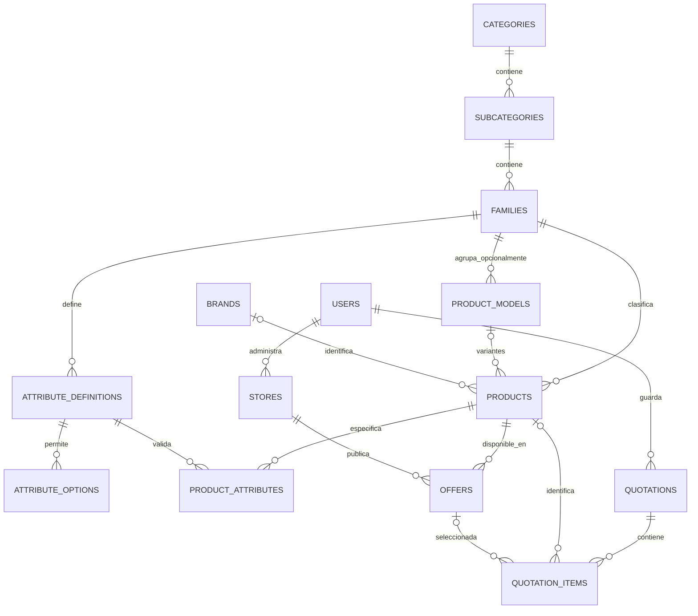

# Diseño relacional de Findi

Fecha de revisión: 2026-10-08. Alcance: diseño basado en el código actual, con DDL ejecutable en una base vacía de validación. **El diseño inicial ya tiene una implementación de transición; consultar [activación de PostgreSQL](activacion-postgresql.md) para el selector, la réplica y el estado operativo.** La migración de datos reales necesita exportación, conciliación y pruebas de convivencia descritas aquí.

## Entregables y alcance revisado

- [Implementación y activación de PostgreSQL](activacion-postgresql.md).

- [Diagrama completo](diagrama-completo.md): las 51 tablas de negocio y conciliación, todas sus columnas y relaciones, más vistas por área y el historial de instalación. También disponible como [archivo Mermaid](diagrama-completo.mmd).
- [Esquema SQL](../../sql/findi/001-schema.sql): 47 tablas de aplicación, dos tablas temporales de conciliación, relaciones, índices y validaciones.
- [Proyecciones públicas](../../sql/findi/002-public-views.sql): catálogo, ofertas y consulta de métricas más recientes.
- [Roles y aislamiento de referencia](../../sql/findi/003-security.sql): lectura pública limitada y RLS para cuentas, cotizaciones y ferreterías.
- [Validación de integridad](../../sql/findi/004-validation.sql): datos sintéticos en una transacción que termina en ROLLBACK.
- [Mapa de campos Firestore → PostgreSQL](mapa-firestore-postgresql.json): las **29 colecciones** declaradas en `functions/src/lib/collections.ts`, incluidas las que llevan prefijo `real_`.
- [Inventario de endpoints](inventario-endpoints.json): **102 definiciones** de rutas en los routers; también se conservan `/config`, `/api/config`, los alias de montaje `/api` y las operaciones de Firebase SDK.
- [Plan de migración y aceptación](plan-migracion-y-validacion.md).

Se revisaron routers, servicios de consentimiento/privacidad/contratos, el motor de cotizaciones, la generación del catálogo público, los jobs de métricas y caché, modelos frontend, persistencia de sesión, scripts del catálogo, reglas Firestore y matriz de retención. Esta revisión del código no es una auditoría de cada documento real: los campos históricos o desconocidos se concilian antes del cambio de base.

## Decisión de arquitectura

PostgreSQL 17 o superior detrás de la API existente. Firebase Authentication sigue administrando credenciales, verificación de correo, recuperación de contraseña y tokens. Hosting, Storage y Cloud Scheduler pueden continuar en Firebase/Google Cloud. La web mantiene `ApiClientService`, endpoints y DTOs actuales; cambia el repositorio del servidor, no los componentes.

Los IDs son `text`: se conservan UID de Firebase y IDs de Firestore, incluidos IDs editoriales largos y marcas con hash. Las filas nuevas pueden usar UUID en formato texto. No renumerar cuentas, productos, ofertas ni cotizaciones; sus enlaces y selecciones ya utilizan esos identificadores.

Separar entornos en bases/proyectos diferentes. La aplicación actual admite solo `real`; no crear un modo demo ni sembrar productos ficticios. Los datos sintéticos de la validación son locales y se revierten.

Los datos del negocio llevan columnas y claves foráneas. JSONB se reserva para evidencia, snapshots de documentos, historial antes/después, payloads derivados y staging temporal; no se transforma Firestore en una tabla genérica de documentos como modelo final. PostgreSQL admite JSONB e índices para esos usos puntuales ([documentación](https://www.postgresql.org/docs/17/datatype-json.html)).

## Modelo del catálogo

La jerarquía existente es **categoría → subcategoría → familia → producto**. Se conserva, aunque coloquialmente se haya llamado “familia” al área más grande. La marca es una entidad vinculada al producto y no un nivel de la taxonomía.

### Productos base y variantes

`products` conserva **cada ficha actual con su mismo ID**, tanto `tipo_base` como `producto_comercial`. El borrado visible se representa con `deleted_at` cuando existen referencias históricas; el adaptador la excluye de listados/detalles y devuelve 404 como antes.

No dividir una ficha existente en varios productos ni transformar bases genéricas en SKUs de marcas inventadas.

`product_models` permite una agrupación semántica opcional. Ejemplo: familia MDF, modelo “MDF melamínico”, productos “MDF negro 15 mm”, “MDF negro 18 mm” y “MDF rojo 18 mm”. Color, espesor, ancho, largo y acabado van en atributos. La marca corresponde a cada variante real. Las fichas existentes pueden quedar sin `model_id` hasta que haya una asociación comprobable.

No se establece UNIQUE global sobre el nombre ni código de barras. Ya existen dos “Conector rápido” en distintas familias: deben conservar identidades y URLs diferentes. La pareja `(store_id, product_id)` sí es única en ofertas, como en el comportamiento actual.

La categoría y subcategoría de un producto se derivan de su familia. El adaptador devuelve `categoriaId` y `subcategoriaId` para conservar los DTOs. Si los IDs actuales no coinciden con esa cadena, la migración registra un conflicto y no decide arbitrariamente cuál eliminar.

### Atributos y formulario administrativo

- Definiciones por familia: código, etiqueta, unidad, tipo `texto/numero/seleccion/booleano`, orden, filtrable y obligatorio.
- Opciones de selección en filas ordenadas; el adaptador reconstruye `opcionesJson`.
- Valores en columnas separadas; exactamente una columna no nula. `false`, `0` y texto vacío no se confunden con ausencia.
- FK compuesta garantiza que definición y producto sean de la misma familia. Trigger comprueba el tipo. Una opción inexistente o un cambio de tipo incompatible falla sin sobrescribir datos.
- El código/etiqueta guardados en atributos actuales se preservan como snapshots, aunque la visualización normalmente utilice la definición.
- La obligatoriedad se evalúa al guardar una variante comercial según las reglas actuales del editor; las bases genéricas siguen permitiendo especificaciones pendientes.
- Los iconos de categorías se conservan como códigos del sistema visual actual, con la misma lista permitida en la API.

### Medios y derechos

`media_assets` registra URL/objeto de Storage, origen, disclosure de IA y datos de generación opcionales. `product_media` conserva orden de galería y una imagen principal. `in_gallery` distingue una imagen principal independiente de un elemento de `galeriaJson`, para reconstruir exactamente incluso una galería vacía; URLs repetidas pueden usar IDs de asset distintos por posición. No se agregan imágenes durante la migración.

`content_rights` almacena fuente, proveedor, términos, respaldo de autorización, derechos de marcas de terceros y revisión. Los derechos de las imágenes y del texto son registros distintos. `product_content_rights` vincula la evidencia editorial a la ficha. Solo la proyección pública de origen/disclosure llega al navegador; nombres de revisores y autorizaciones permanecen privados.

## Ofertas, precios, stock y comparación

`offers` vincula ferretería y producto. Guarda SKU local, código de barras, precio, stock, IVA, medida declarada, vigencia, condiciones, patrocinio, publicación, retiro y estado previo de moderación.

Precio y cantidades de medida usan `numeric` sin conversión obligatoria a centavos ni redondeo en la migración. La moneda actual es CLP; el precio informado ya incluye IVA. Stock e ítems de cotización siguen siendo enteros no negativos/positivos como ahora. No se introduce IVA adicional ni envío dentro de la comparación.

La vista pública conserva el filtro del servidor: oferta activa/publicada, producto y local activos, propietario activo, contrato vigente con versión/hash actuales, vigencia temporal y precio positivo. **Una oferta sin stock puede verse en el detalle**, pero `comparison_eligible=false`; no aparece como alternativa comprable ni se trata como un precio cero válido.

La unidad de precio puede ser kg, l, m, m2, m3 o unidad. Se conservan cantidad y procedencia. La inferencia de presentación y conversión de precio unitario sigue utilizando `inferMeasurementFromLabel`/`pricePerMeasurement`: no sustituirla por un parseo SQL distinto.

`offer_history` conserva precio anterior/nuevo, acción, actor, fuente, fechas y snapshots completos antes/después. La corrección de un reclamo y aprobación de solicitud enlazan su evidencia. Al eliminar una oferta, las FK quedan nulas y los IDs de referencia del historial permanecen; no se pierde evidencia.

Creación, actualización, corrección y aprobación deben ejecutarse en **una transacción** que incluya oferta, evidencia, revisión de catálogo y evento outbox. La importación Excel actual conserva matching exacto/posible/sin coincidencia; `import_batches/import_rows` son extensiones operativas opcionales para rastrear lotes, no una nueva obligación en el formulario.

## Cotizaciones y selección de productos

`quotations` es el equivalente de `proyectos`: dueño, nombre, dirección, proximidad opcional, ferretería única seleccionada y fechas. `quotation_items` conserva orden, líneas repetidas, cantidades, producto y oferta seleccionados, nombres originales y referencias históricas.

La selección por IDs tiene prioridad. Los nombres quedan como snapshots para registros antiguos o entidades retiradas. No resolver “Conector rápido” únicamente por nombre si existen varias fichas; registrar `ambiguous` y resolver con evidencia. Los ítems sin producto maestro continúan representables (`product_id=NULL`); no se descartan listas históricas de texto.

Las FK opcionales se desvinculan cuando desaparece una oferta/local; el nombre y referencia siguen disponibles. La selección explícita retirada debe seguir informándose como no disponible, sin elegir silenciosamente otra ferretería.

**Precios y ahorro siguen siendo vivos**: una cotización no congela el precio al crearla. Se mantiene `buildQuotationOptimization` como referencia para ferretería única, selección explícita, proximidad, comparación por producto, stock compartido entre líneas repetidas, IVA, disponibilidad y cálculo de ahorro. La respuesta conserva `availabilityStatus`, `pricesCheckedAt` y `pricingMode='live'` calculados.

El límite actual de dos cotizaciones por dueño se representa con `users.quotation_limit=2` y un trigger que bloquea la fila del dueño antes de contar/crear. No es seguro usar solo COUNT desde dos solicitudes concurrentes. Un traslado de propietario exige el mismo control. PostgreSQL ofrece bloqueo de filas y niveles de aislamiento; los servicios deben tratar reintentos por conflictos ([documentación](https://www.postgresql.org/docs/17/transaction-iso.html)).

`account_preferences` puede guardar la cotización seleccionada y local principal por cuenta para uso entre dispositivos. Es opcional: la selección actual en localStorage sigue funcionando. Si se usa SQL, al borrar una cotización hay que limpiar la selección en la misma transacción; la FK diferida evita selecciones de otro dueño.

Los flujos públicos permanecen: login/registro vuelve a la URL anterior, modal crea y selecciona cotización, acción explícita agrega producto. Esas decisiones de navegación no requieren tablas nuevas.

## Identidad, contratos y consentimientos

La cuenta mantiene rol `maestro/ferreteria/admin`, estado, perfil, aceptación actual y bloqueo de tratamiento. Ninguna tabla almacena contraseña, refresh token, enlace de recuperación ni código de verificación. Firebase Auth mantiene la verificación de correo como fuente autorizada; un correo escrito en un perfil SQL no prueba que se haya verificado.

`legal_documents` guarda versión, contenido y hash de términos, privacidad y contrato. No editar el documento antiguo para representar uno nuevo. La aceptación de contrato conserva proveedor, local, firmante, declaraciones y evidencia tal como existían al aceptar.

`consent_events` conserva términos, privacidad, mayoría de edad y marketing separadamente, con propósito, consentimiento expreso, versión, fuente y fecha. No se interpreta la aceptación legal obligatoria como consentimiento de marketing.

El primer ingreso de una ferretería registra declaraciones legales y contrato en la misma transacción. Se mantienen ambas formas actuales de aceptación: modal simplificado de onboarding e identificación detallada del contrato. No inventar RUT/cargo del firmante del modal.

Suspender/terminar contrato actualiza contrato y estado comercial, retira las ofertas y cambia la revisión pública de forma atómica. La contratación de un plan pagado necesitaría condiciones y aceptación distintas; no existe un módulo de cobros implementado y no se inventan facturas ni ventas históricas.

La persistencia al recargar, 30 minutos de inactividad, “Recordarme”, coordinación entre pestañas y logout permanecen en `AuthService`/Firebase SDK. El cambio de base no modifica la regla de contraseña actual de 6–128 caracteres con mayúscula/minúscula/número/símbolo ni las validaciones del formulario.

## Métricas nocturnas de ferretería

- `store_event_counters` conserva vistas/selecciones anónimas acumuladas. Incrementar con `UPDATE ... SET views=views+1`, no leer-modificar-escribir en JS.
- `store_daily_analytics` guarda un corte por `(store_id, local_date)`. El reporte actual se importa solo en su fecha real; no se fabrican días pasados.
- `store_daily_top_products` guarda ranking, producto/nombre, cotizaciones distintas, unidades, monto activo y stock al corte.
- `job_runs(job_name, local_date)` impide dos ejecuciones programadas el mismo día local.
- Continúa Cloud Scheduler a las **02:00 America/Santiago**, incluso en cambios de horario de verano. La región del worker actual no requiere cambiar por esta propuesta.
- “Activa” conserva los últimos 30 días de actividad, sin incluir estados cerrados/archivados. “Reciente” compara creación en los últimos siete días frente a los siete anteriores.
- Atribuir cada línea a la selección/optimización real, no a todas las ferreterías que venden el producto. Demandas explícitas sin oferta disponible pueden tener unidades y monto cero.
- Reutilizar `aggregateStoreDailyAnalytics` y el motor de cotización con un snapshot consistente. Una transacción REPEATABLE READ o un export consistente evita mezclar precios de horas distintas durante el cálculo.
- El dashboard lee el último corte; no consulta cotizaciones de clientes en tiempo real ni expone dueño, dirección o ID de cotización a la ferretería.

El monto cotizado es referencial, no ingreso, venta ni reserva. El agregado actual cubre cotizaciones guardadas, no cotizaciones eliminadas. Guardar nuevos cortes diarios permite historia futura sin reinterpretar los datos antiguos.

## Contacto, privacidad, reclamos y gobierno

| Función | Tablas y comportamiento preservado |
|---|---|
| Mensajes de contacto | `contact_messages`: campos del formulario, aceptación, estados pendiente/contactado/cerrado. Solicitar acceso sigue abriendo WhatsApp; no recrear el menú de solicitudes de acceso. |
| Salida de publicidad | `marketing_suppressions` + eventos de marketing; preservar esquema de hash para impedir reimportación. Respuesta pública idéntica para evitar enumeración de cuentas. |
| Derechos y bloqueo | `privacy_requests`: tipo, detalles, recepción, plazos reales guardados, resolución y responsable; bloqueo y desbloqueo conservan fechas y solicitudes abiertas. |
| Exportación de datos | Reconstruir el mismo JSON por UID; registros anónimos por correo solo si Firebase confirma titularidad de ese correo. |
| Eliminación | Borrar perfil, cotizaciones, solicitudes y vínculos conforme al flujo; minimizar contratos, historial de precios, reclamos y denuncias; limpiar cachés y staging. |
| Comprobante de eliminación | `deletion_receipts`: fecha/conteos/fuente sin UID ni correo. |
| Coordinación con Auth | `account_deletion_jobs`: saga privada con UID transitorio; completar solo tras confirmar borrado de Auth; eliminar UID al finalizar. |
| Reclamos de precios | `price_reports` + `offer_history`: referencia, tres precios, oferta/local, consentimiento, decisión y corrección atómica. |
| Propiedad intelectual | `ip_reports` + `ip_report_events`: denunciante, obra, destino, declaraciones, plazos, seguimiento y decisiones; estado previo de ofertas permite restaurarlas correctamente. |
| Seguimiento privado de denuncia | Comparar referencia + hash del token y devolver únicamente los campos públicos actuales. No entregar hash ni datos del denunciante al endpoint público. |
| Auditoría administrativa | `admin_audit_logs`: actor/rol, método/ruta, código HTTP, outcome y fecha. |
| Incidentes | `security_incidents`: sistemas/datos afectados, severidad, acciones, causa, notificaciones, cierre y responsables. |
| Evidencia operativa | `governance_evidence`: tipo, resultado, responsable, fechas, enlaces, notas y próxima revisión. |

Al eliminar una cuenta, borrar una FK no elimina los datos personales incrustados en snapshots. El servicio de privacidad debe minimizar también `signer_snapshot`, `evidence`, reclamantes, correos, notas libres, auditorías cuando corresponda, jobs de eliminación y staging. Los IDs de referencias retenidas se clasifican: un UID no se trata como un identificador empresarial anónimo.

La matriz de retención vigente en [retention-deletion-matrix.md](../governance/retention-deletion-matrix.md) sigue siendo política interna pendiente de validación jurídica. Los plazos no se redefinen aquí. `legal_hold`/`retention_until` permiten controlar vencimientos y controversias. El hash simple de correo de marketing no debe describirse como garantía criptográfica de anonimato; debe mantenerse restringido.

El borrado SQL y Firebase Auth no comparten transacción. La saga reintenta fallos, no declara eliminación completa cuando Auth falla y no deja una cuenta utilizable tras un borrado parcial. Se necesita política de revocación/estado durante la operación y conciliación; no ejecutar un DELETE masivo y luego asumir éxito.

## Búsqueda rápida, caché y SEO

`catalog_search_documents` y su índice GIN sirven para búsquedas del servidor. No reemplazan el autocompletado en memoria/IndexedDB: se sigue publicando un índice pequeño con productos, familias y marcas sin precios ni campos privados. La normalización española, acentos, unidades y ranking actuales se mantienen; cambiar a búsqueda textual PostgreSQL sin pruebas de equivalencia modificaría los resultados. GIN es un tipo de índice apropiado para búsqueda textual ([documentación](https://www.postgresql.org/docs/17/textsearch-indexes.html)).

`catalog_revisions` separa `static` y `offers`. Cambiar nombre/marca/atributos/taxonomía invalida ficha e índice; precio/stock solo invalida oferta/catálogo comercial. Cambio de contrato, estado de dueño/local o moderación invalida visibilidad de ofertas.

Las transacciones crean `outbox_events`; un worker reconstruye `public_cache_artifacts`/objetos JSON versionados. Nunca enviar evidencia legal ni perfiles privados a CDN/IndexedDB. Los eventos son idempotentes y la API verifica la revisión cuando el artefacto todavía no refleja el cambio. No depender únicamente de una reconstrucción nocturna para ver un cambio administrativo.

`seo_routes` registra los paths que ya existen, incluidos los dos conectores con nombres iguales. Los paths no se recalculan arbitrariamente al importar. Un cambio de nombre puede conservar su path o crear alias 301 al nuevo canonical. Alias de una entidad deben apuntar a su canonical de esa misma entidad, sin ciclos; la API administra esa invariancia adicional.

Se conservan HTML inicial de fichas/colecciones, canonical, Product/BreadcrumbList/CollectionPage, sitemap de productos base sin ofertas, páginas de categorías/familias/marcas, 404 reales y noindex de cuentas. El resultado SEO se genera desde proyecciones públicas. Search Console y dominio son configuraciones externas.

## Autorización y operación

La base no se expone desde Angular. El servidor valida JWT de Firebase, rol, estado, tratamiento bloqueado, aceptación legal y propiedad antes de ejecutar operaciones.

`003-security.sql` es una **base de roles/RLS de referencia**, no un permiso completo para todos los servicios administrativos. Contiene lectura pública de vistas, consultas privadas por dueño y escritura de cotizaciones/preferencias. Registro, administración, contratos, catálogo, privacidad, denuncias anónimas y workers necesitan funciones transaccionales específicas o conexiones privadas dedicadas con grants auditados al implementar la migración. No desplegarlo y asumir que todos los endpoints ya tienen acceso.

- El API login SQL no debe ser dueño de tablas, superusuario ni BYPASSRLS. El dueño de migraciones es otra identidad.
- Establecer `findi.user_id` con `set_config(..., true)` dentro de una transacción después de verificar JWT. No aceptar UID/rol como prueba de identidad del cuerpo HTTP ni dejar contexto persistente en conexiones del pool.
- RLS aísla dueño de cotización/local. Las consultas de administración verifican un perfil admin activo. Permisos de columnas evitan que un usuario cambie su rol por sí mismo.
- Los helpers SECURITY DEFINER tienen search_path fijo y dueño restringido. El dueño de esquema puede eludir RLS: sus credenciales nunca pertenecen a clientes ni al API normal.
- Las proyecciones públicas son explícitas; no conceder SELECT de `users`, derechos, contratos o reclamantes al lector público.
- La vista `latest_store_analytics` usa security_invoker para respetar RLS de sus tablas.
- Rate limiting, CORS, límites HTTP, honeypots, autenticación reciente para borrar cuenta y mensajes anti-enumeración siguen en la API. No trasladarlos a una tabla de “sesiones SQL” que sustituya Firebase.

PostgreSQL permite políticas por fila, pero dueños de tabla y cuentas privilegiadas tienen reglas especiales que hay que considerar en despliegue ([documentación](https://www.postgresql.org/docs/17/ddl-rowsecurity.html)).

## Validación realizada y límites

Los tres archivos de esquema/proyecciones/seguridad se ejecutaron en un PostgreSQL embebido local mediante PGlite, en una base vacía. La validación incluye claves foráneas, tipos de atributos, opciones, límite de cotizaciones, identidad oferta/producto, precios/stock, visibilidad por contrato, aislamiento por dueño, lectura pública restringida, preservación de historial tras borrar una oferta e idempotencia del job.

Eso comprueba DDL y reglas sobre datos sintéticos; no prueba despliegue Cloud SQL, dos conexiones concurrentes, tamaño/costo real, importación de datos reales ni equivalencia completa de endpoints. Esas pruebas forman parte obligatoria del plan de migración. Ningún archivo SQL se ejecutó contra producción.
